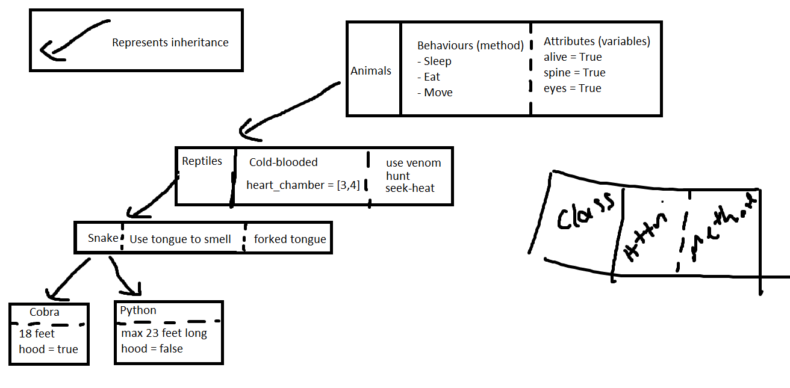

# Python OOP

## Animal File (Base class)
```python
class Animal:
    def __init__(self):
        self.alive = True
        self.spine = True
        self.eyes = None

    def sleep(self):
        return "zzz"

    def eat(self):
        return "yum"


p1 = Animal()
print(p1.sleep())
```
## Reptile File
```python
from animals import Animal


#create reptile class
class Reptile(Animal):  # write the name of the parent class in () to inherit
    # parent class - base class - super class (same thing)
    def __init__(self):
        # have to let it know to inherit everything from parent class
        super().__init__()
        self.cold_blooded = True
        self.heart_chambers = [3,4]
    
    # creates the functions
    def seek_heat(self):
        return "looking for the sun shine"

    def hunt(self):
        return "working hard to catch a next meal"


# creates object
# p2 = Reptile()
# print(p2.sleep())
# print(p2.hunt())
# print(p2.cold_blooded)
# print(p2.alive)
```
## Snakes file
```python
# imports reptile class which in turn inherits the animal class
from reptiles import Reptile


class Snakes(Reptile):
    def __init__(self):
        super().__init__()
        self.forked_tongue = True
        self.__scales = 10

    def tongue_smell(self):
        return "you smell nice :) "

    def seek_heat(self):
        return "i am plenty warm :) "

    # protected module '_'
    def _move(self):
        return "slithers"

    # private module '__'
    def __hiss(self):
        return "hello"


p3 = Snakes()
print(p3.forked_tongue)
print(p3.tongue_smell())
print(p3.seek_heat())
print(p3.sleep())

# You can access from anywhere it is just notation to let developers know  to not touch it
print(p3._move())
print(p3._Snakes__hiss())
print(p3._Snakes__scales)
p3._Snakes__scales = 11
print(p3._Snakes__scales)

# Also works with parent classes
print(p3._Reptile__hunt())
```
